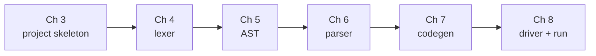
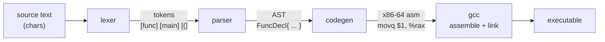
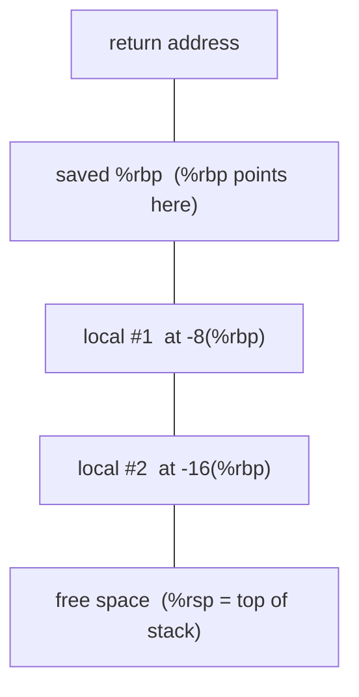
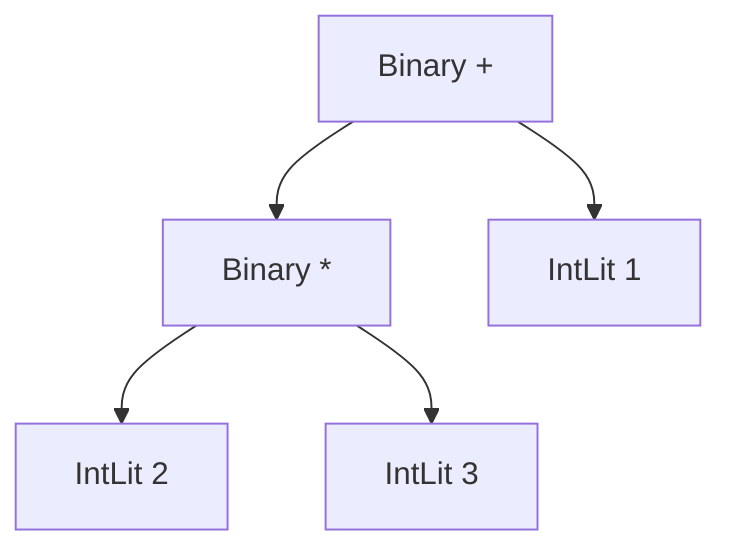
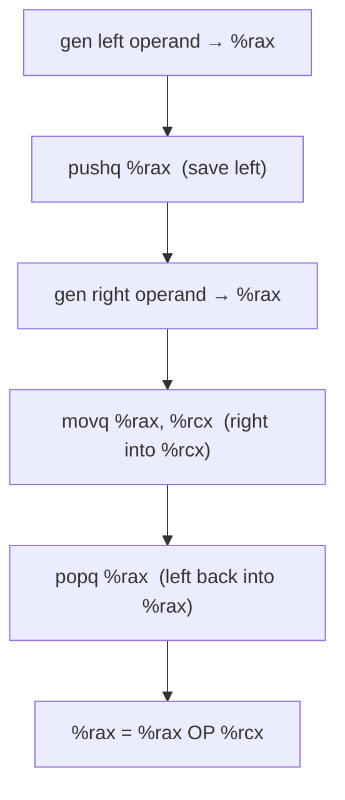

# Writing Your Own Compiler

A build-along guide. You will write a compiler that turns source code into a
native Linux executable, starting from an empty directory and adding one file at
a time, understanding every line as you go.

The language you compile is **Tin**: a tiny invented language with functions,
recursion, loops, variables, and integer arithmetic. The compiler is written in
**Go** and emits real **x86-64 assembly**, which `gcc` assembles and links into
a binary you run directly.

This is written in the spirit of *Linux From Scratch*: every step in order, and
every step something you can check. Every piece of code is shown in full and goes
into a named file. You
type it, you build it, and at the end of each stage you **run what you have** and
see real output before moving on. Nothing is hand-waved and no code appears by
magic in a later chapter.

By the end you will have a working compiler, and a concrete mental model of how
source text becomes registers, a stack frame, and machine instructions.

---

## How to use this guide

**Prerequisites.**

- Some programming experience. The compiler is written in Go; anyone comfortable
  with a C-family language will be able to follow it, though a little Go helps.
  None of Go's advanced features come up. The code uses structs, slices, maps,
  and one type switch, and the guide explains each as it appears.
- A **Linux x86-64** machine with `go` (1.21+) and `gcc` installed. To check:

  ```sh
  go version
  gcc --version
  ```

- You do **not** need to know assembly. [Chapter 1](#1-an-assembly-primer) teaches
  exactly enough to read what the compiler emits.

**Conventions.**

- A shell command is shown with a `$` prompt:

  ```sh
  $ go build -o tinc .
  ```

- A code block headed by a filename means *that code goes into that file*, in the
  order shown. When a chapter builds a file across several blocks, appending them
  in order reproduces the file exactly. The finished copy of every file lives in
  [`reference/`](reference/) — diff against it whenever you're unsure.

- A **Checkpoint** is a point where you build and run what you have so far. Do not
  skip them; they catch mistakes while the surface area is still small.

**The plan.** We build strictly bottom-up, so every checkpoint compiles and runs:



---

## 0. The shape of a compiler

A compiler is a pipeline. Text goes in one end; machine code comes out the other.
Ours has four stages, and the chapters map directly onto them:



- **Lexer** (or *scanner*): turns a flat string into a list of **tokens**, the
  words of the language. `x = 1 + 2` becomes `IDENT(x) = INT(1) + INT(2)`.
- **Parser**: turns the token list into an **abstract syntax tree** (AST), which
  captures structure. `1 + 2 * 3` becomes a tree where `*` binds tighter than `+`.
- **Code generator**: walks the AST and emits assembly instructions.
- **Assembler + linker** (`gcc`, which we don't write): turns assembly text into a
  runnable binary.

Real compilers add stages between parsing and codegen: type checking,
optimization, intermediate representations. We leave all of them out. A working
four-stage compiler teaches the shape of the whole thing; the extra stages are
depth you add later ([`advanced.md`](advanced.md)).

---

## 1. An assembly primer

You only need to *read* the assembly the compiler emits, not write it fluently.
Here is the minimum. If you already know x86-64, skim to
[Chapter 2](#2-the-tin-language).

### 1.1 The machine model

A CPU has a handful of **registers** (64-bit slots it computes in) and a
**stack**, a region of memory it pushes and pops values on. The compiler uses
these registers:

| Register | Role in our compiler |
|----------|----------------------|
| `%rax`   | the accumulator — *every expression leaves its result here* |
| `%rcx`   | scratch — the right-hand side of a binary operation |
| `%rbp`   | frame pointer — anchors the current function's stack frame |
| `%rsp`   | stack pointer — points at the top of the stack |
| `%rdi`, `%rsi`, `%rdx`, `%rcx`, `%r8`, `%r9` | the first six function arguments |

That last row is the **System V AMD64 calling convention**, the Linux standard
for how functions pass arguments. Argument 1 goes in `%rdi`, argument 2 in
`%rsi`, and so on; return values come back in `%rax`. We follow it so our
functions can call each other and call libc's `printf`.

### 1.2 AT&T syntax

We emit **AT&T syntax**, which `gcc`'s assembler speaks with no extra flags. Two
things to burn in:

1. **Order is `source, destination`.** `movq %rcx, %rax` means "copy rcx *into*
   rax". This is the opposite of Intel syntax, which most online references and
   `objdump` use by default. Reading Intel examples, mentally flip the operands.
2. **Sigils:** registers get `%`, literal (immediate) values get `$`. So
   `movq $5, %rax` puts the literal 5 into rax. The `q` suffix means "quad"
   (64-bit).

### 1.3 The instruction set we use

The entire compiler emits only these:

```
movq $5, %rax        # rax = 5
movq %rcx, %rax      # rax = rcx
movq -8(%rbp), %rax  # rax = memory at (rbp - 8)   ← load a local variable
movq %rax, -8(%rbp)  # memory at (rbp - 8) = rax   ← store a local variable
pushq %rax           # push rax onto the stack (rsp -= 8, then store)
popq %rax            # pop the stack into rax (load, then rsp += 8)
addq %rcx, %rax      # rax = rax + rcx
subq %rcx, %rax      # rax = rax - rcx
imulq %rcx, %rax     # rax = rax * rcx
cqto                 # sign-extend rax into rdx:rax (division needs this)
idivq %rcx           # signed divide rdx:rax by rcx; quotient in rax
cmpq %rcx, %rax      # compare rax to rcx, set flags (computes rax - rcx)
setl %al             # al = 1 if last cmp was "less than", else 0
movzbq %al, %rax     # zero-extend the byte al into the full rax
negq %rax            # rax = -rax
jmp .Llabel          # unconditional jump
je .Llabel           # jump if last cmp was equal (zero)
call name            # push return address, jump to `name`
leave                # tear down the frame: movq %rbp,%rsp ; popq %rbp
ret                  # pop the return address and jump back to the caller
```

`%al` is the low 8 bits of `%rax`. The `set*` instructions write only that byte,
so we always follow them with `movzbq` to get a clean 0 or 1 in the full register.

### 1.4 A stack frame

When a function runs, it carves out a **frame** on the stack for its locals. The
standard prologue and epilogue:

```
myfunc:
    pushq %rbp          # save the caller's frame pointer
    movq %rsp, %rbp     # this function's frame pointer = current stack top
    subq $16, %rsp      # reserve 16 bytes for locals
    ...                 # body: locals at -8(%rbp), -16(%rbp), ...
    leave               # restore rsp and rbp
    ret                 # return to caller
```

After `pushq %rbp`, the frame pointer `%rbp` is a fixed anchor for the whole
function. Local #1 lives at `-8(%rbp)`, #2 at `-16(%rbp)`, and so on. Because
`%rbp` doesn't move, those offsets stay constant. That is the whole point of a
frame pointer.



(Higher addresses at the top. The stack grows *downward*, so `%rsp` sits at the
bottom and each local is a fixed negative offset from the anchor `%rbp`.)

That is enough assembly. Everything the compiler emits is built from the list
above.

---

## 2. The Tin language

Tin is small on purpose. Here is a complete program, recursive Fibonacci:

```tin
func fib(n) {
    if n < 2 {
        return n;
    }
    return fib(n - 1) + fib(n - 2);
}

func main() {
    print fib(10);
}
```

Running the compiled program prints `55`.

### 2.1 The rules

- **One type: 64-bit signed integer.** No strings, floats, or booleans.
  Comparisons produce `1` or `0`.
- **A program is a list of functions.** Execution starts at `main`.
- **`func name(params) { ... }`** declares a function; up to six parameters (the
  calling convention's register budget).
- **`let x = expr;`** declares a local; **`x = expr;`** reassigns one.
- **`if cond { ... } else { ... }`** — `else` optional; any nonzero value is true.
- **`while cond { ... }`** loops.
- **`return expr;`** returns a value; **`print expr;`** prints an integer and a
  newline (our one built-in, which calls libc `printf`).
- **Operators:** `+ - * /`, comparisons `< > <= >= == !=`, unary minus,
  parentheses. Standard precedence.
- **Comments** run from `#` to end of line.

### 2.2 The grammar

Written as EBNF (`{ }` = zero or more, `[ ]` = optional):

```ebnf
program    = { funcDecl } ;
funcDecl   = "func" IDENT "(" [ IDENT { "," IDENT } ] ")" block ;
block      = "{" { statement } "}" ;
statement  = "let" IDENT "=" expr ";"
           | IDENT "=" expr ";"
           | "if" expr block [ "else" block ]
           | "while" expr block
           | "return" expr ";"
           | "print" expr ";"
           | expr ";" ;
expr       = equality ;
equality   = comparison { ( "==" | "!=" ) comparison } ;
comparison = term       { ( "<" | ">" | "<=" | ">=" ) term } ;
term       = factor     { ( "+" | "-" ) factor } ;
factor     = unary      { ( "*" | "/" ) unary } ;
unary      = "-" unary | primary ;
primary    = INT
           | IDENT
           | IDENT "(" [ expr { "," expr } ] ")"
           | "(" expr ")" ;
```

That layering, where `equality` contains `comparison` contains `term` contains
`factor`, is how the grammar encodes **precedence**. Operators lower in the
chain (like `*`) bind tighter because they are matched deeper. You will watch the
parser turn this layering into code in [Chapter 6](#6-the-parser), and you can
*see* the resulting tree with `tinc -ast` once it's built.

### 2.3 Errors and sharp edges

Tin's compiler stops at the first error and reports a line number. Real compilers
recover and report many at once with a caret at the exact column, but error
recovery is a substantial topic that would swamp the parser; we take the honest
shortcut. See [`advanced.md`](advanced.md).

Three deliberate simplifications, worth knowing before they surprise you:

- **Variables are function-scoped, not block-scoped.** A `let` inside an `if` or
  `while` reuses an outer variable of the same name rather than shadowing it. So
  this prints `2` then `2`, not `2` then `1`:

  ```tin
  let x = 1;
  if 1 { let x = 2; print x; }
  print x;
  ```

  We'll see why in [7.3](#73-variables-and-frames): every variable gets one frame
  slot, keyed by name.

- **A `main` function is required.** The compiler reports
  `no 'main' function to run` up front, rather than letting the failure surface
  later as a cryptic `undefined reference to 'main'` from the linker.

- **Division by zero is not checked.** `1 / 0` compiles and then crashes at
  runtime with `SIGFPE`, straight from the CPU's `idivq`.

---

## 3. Project skeleton

Create the project directory and initialize a Go module.

```sh
$ mkdir tin && cd tin
$ go mod init tinc
```

That writes a `go.mod`:

```
module tinc

go 1.21
```

The `go` line records whatever toolchain you ran `go mod init` with, so a newer
Go will stamp a higher number there. Anything 1.21 or later is fine.

Everything we build lives in this one directory as **package main**. Go compiles
every `.go` file in the directory together, so functions and types defined in one
file are visible in the others, and we lean on that to split the compiler into
`lexer.go`, `parser.go`, `codegen.go`, and so on, with no imports between them.

Now a first `main.go`. This version does nothing but read a file and echo it,
just enough to have something that builds and runs, and to establish two helpers
we'll rely on everywhere.

```go
// main.go  (temporary — we replace it in Chapter 8)
package main

import (
	"fmt"
	"os"
)

func main() {
	if len(os.Args) != 2 {
		fmt.Fprintln(os.Stderr, "usage: tinc <file.tin>")
		os.Exit(2)
	}
	src, err := os.ReadFile(os.Args[1])
	if err != nil {
		fmt.Fprintf(os.Stderr, "tinc: %v\n", err)
		os.Exit(1)
	}
	fmt.Print(string(src)) // temporary: echo the file back as text
}

// fatalf reports a compile error and exits. Line 0 means "no line info".
func fatalf(line int, format string, args ...interface{}) {
	msg := fmt.Sprintf(format, args...)
	if line > 0 {
		fmt.Fprintf(os.Stderr, "tinc: line %d: %s\n", line, msg)
	} else {
		fmt.Fprintf(os.Stderr, "tinc: %s\n", msg)
	}
	os.Exit(1)
}

// align16 rounds n up to the next multiple of 16 (stack alignment). Codegen
// uses it later; it's a package-level helper so it can live here.
func align16(n int) int {
	if n%16 == 0 {
		return n
	}
	return n + (16 - n%16)
}
```

`fatalf` is how *every* stage reports errors: a message, an optional line number,
exit status 1. Passing `0` for the line means "no position information," which
codegen relies on, since by then we've discarded line numbers. `align16` is unused for
now; Go is fine with an unused package-level function (only unused imports and
local variables are errors), and it saves us touching `main.go` again until the
end.

**Checkpoint.** Create a scratch program and run the echo:

```sh
$ echo 'func main() { print 42; }' > hello.tin
$ go run . hello.tin
func main() { print 42; }
```

If that prints your file back, the module is set up correctly. On to the lexer.

---

## 4. The lexer

The lexer turns source text into a stream of **tokens**, the words of the
language. It reads left to right, skips whitespace and comments, and emits one
token per meaningful chunk.

We build `lexer.go` in four blocks: the token kinds, the token type and lookup
tables, the scanning loop, and small character helpers.

### 4.1 Token kinds

Every token has a **kind**. Create `lexer.go` with the full list:

```go
// lexer.go
package main

// TokenKind is the category of a lexical token.
type TokenKind int

const (
	TEOF TokenKind = iota
	TInt
	TIdent
	// keywords
	TFunc
	TLet
	TIf
	TElse
	TWhile
	TReturn
	TPrint
	// punctuation
	TLParen
	TRParen
	TLBrace
	TRBrace
	TComma
	TSemicolon
	TAssign
	// operators
	TPlus
	TMinus
	TStar
	TSlash
	TEq
	TNe
	TLt
	TGt
	TLe
	TGe
)
```

`iota` gives each constant a distinct integer automatically. The exact values
don't matter, only that they're distinct, so we never write them down.

### 4.2 The token type and lookup tables

Append the `Token` struct and two maps: keywords, and single-character
punctuation/operators.

```go
// Token is one lexical unit, with its raw text and source line.
type Token struct {
	Kind TokenKind
	Text string
	Line int
}

// keywords maps every reserved word to its kind. A word not in here is a TIdent.
var keywords = map[string]TokenKind{
	"func":   TFunc,
	"let":    TLet,
	"if":     TIf,
	"else":   TElse,
	"while":  TWhile,
	"return": TReturn,
	"print":  TPrint,
}

// singles maps each one-character token to its kind.
var singles = map[byte]TokenKind{
	'(': TLParen,
	')': TRParen,
	'{': TLBrace,
	'}': TRBrace,
	',': TComma,
	';': TSemicolon,
	'=': TAssign,
	'+': TPlus,
	'-': TMinus,
	'*': TStar,
	'/': TSlash,
	'<': TLt,
	'>': TGt,
}
```

Keeping the `Line` on every token is what lets later stages say "error on line 7".
The `keywords` map is the trick that separates keywords from identifiers: we read
a word, then check whether it's in the map.

### 4.3 The scanning loop

This is the heart of the lexer. Append it:

```go
// lex turns source text into a slice of tokens ending in TEOF. It scans left to
// right with an index i, deciding each token from the character under i.
func lex(src string) []Token {
	var toks []Token
	line := 1           // current source line, for error messages
	i, n := 0, len(src) // i is the scan position; n is the end
	for i < n {
		c := src[i] // the character we're deciding on
		switch {
		case c == '\n': // newline: bump the line counter, then skip it
			line++
			i++
		case c == ' ' || c == '\t' || c == '\r': // other whitespace: skip
			i++
		case c == '#': // comment: skip everything up to the next newline
			for i < n && src[i] != '\n' {
				i++
			}
		case isDigit(c): // a run of digits becomes one integer token
			j := i
			for j < n && isDigit(src[j]) {
				j++
			}
			toks = append(toks, Token{TInt, src[i:j], line})
			i = j
		case isAlpha(c): // a word: a keyword if it's in the table, else an identifier
			j := i
			for j < n && isAlphaNum(src[j]) {
				j++
			}
			text := src[i:j]
			kind := TIdent
			if k, ok := keywords[text]; ok {
				kind = k
			}
			toks = append(toks, Token{kind, text, line})
			i = j
		default: // punctuation and operators
			// Try a two-character operator (== != <= >=) before a single one,
			// since its first character alone is ambiguous.
			if i+1 < n {
				if k, ok := twoChar(src[i], src[i+1]); ok {
					toks = append(toks, Token{k, src[i : i+2], line})
					i += 2
					continue
				}
			}
			k, ok := singles[c]
			if !ok {
				fatalf(line, "unexpected character %q", string(c))
			}
			toks = append(toks, Token{k, string(c), line})
			i++
		}
	}
	toks = append(toks, Token{TEOF, "", line}) // sentinel: marks end of input
	return toks
}
```

Read the cases in order. The lexer decides what token starts at position `i` from
the first character:

- Newline bumps the line counter; other whitespace is skipped.
- `#` skips to end of line; that's how comments work.
- A digit starts a run of digits → one `TInt` whose `Text` is the whole number.
- A letter starts an identifier; if the finished word is in `keywords`, it becomes
  that keyword, otherwise `TIdent`.
- Otherwise we're at punctuation. We **peek** at two characters first, because
  `==`, `!=`, `<=`, `>=` can't be decided from the first character alone. If the
  pair isn't a two-character operator, we fall back to the single-character table.
  Anything not in either table is a lexing error.

The final `TEOF` token is a sentinel. The parser leans on it heavily: it can
always call "what's next?" without checking whether it's run off the end.

### 4.4 The helpers

Append `twoChar` and the character classifiers:

```go
// twoChar recognizes the four two-character operators. The bool is false for any
// other pair, which sends the lexer back to the single-character table.
func twoChar(a, b byte) (TokenKind, bool) {
	switch {
	case a == '=' && b == '=':
		return TEq, true
	case a == '!' && b == '=':
		return TNe, true
	case a == '<' && b == '=':
		return TLe, true
	case a == '>' && b == '=':
		return TGe, true
	}
	return TEOF, false
}

// Character classifiers. isAlpha allows a leading underscore, so _x is a name.
func isDigit(c byte) bool { return c >= '0' && c <= '9' }
func isAlpha(c byte) bool {
	return c == '_' || (c >= 'a' && c <= 'z') || (c >= 'A' && c <= 'Z')
}
func isAlphaNum(c byte) bool { return isAlpha(c) || isDigit(c) }
```

Note `!` exists *only* as part of `!=` (there's no single `!` token), so a lone
`!` falls through to the "unexpected character" error. That's fine for Tin, which
has no boolean-not operator.

`lexer.go` is now complete and matches [`reference/lexer.go`](reference/lexer.go).

### 4.5 Seeing the tokens

To look at the lexer's output we need a way to print tokens. Create `debug.go`
with a token dumper (we'll add an AST dumper to this same file in Chapter 6):

```go
// debug.go
package main

import "fmt"

// kindName gives each token kind a readable label for `tinc -tokens`.
var kindName = map[TokenKind]string{
	TEOF: "EOF", TInt: "INT", TIdent: "IDENT",
	TFunc: "func", TLet: "let", TIf: "if", TElse: "else",
	TWhile: "while", TReturn: "return", TPrint: "print",
	TLParen: "(", TRParen: ")", TLBrace: "{", TRBrace: "}",
	TComma: ",", TSemicolon: ";", TAssign: "=",
	TPlus: "+", TMinus: "-", TStar: "*", TSlash: "/",
	TEq: "==", TNe: "!=", TLt: "<", TGt: ">", TLe: "<=", TGe: ">=",
}

// dumpTokens prints the token stream, one per line (used by `tinc -tokens`).
func dumpTokens(toks []Token) {
	for _, t := range toks {
		fmt.Printf("%3d  %-8s %q\n", t.Line, kindName[t.Kind], t.Text)
	}
}
```

Now point the temporary `main.go` at it. Replace the echo line
(`fmt.Print(string(src))`) with these two:

```go
	// main.go — in place of fmt.Print(string(src))
	toks := lex(string(src)) // source text -> tokens
	dumpTokens(toks)         // print them, one per line
```

**Checkpoint.** Lex the sample expression:

```sh
$ echo 'func main() { print 1 + 2 * 3; }' > p.tin
$ go run . p.tin
  1  func     "func"
  1  IDENT    "main"
  1  (        "("
  1  )        ")"
  1  {        "{"
  1  print    "print"
  1  INT      "1"
  1  +        "+"
  1  INT      "2"
  1  *        "*"
  1  INT      "3"
  1  ;        ";"
  1  }        "}"
  2  EOF      ""
```

That's the source reduced to its words, each tagged with kind and line. (`EOF`
lands on line 2 because `echo` adds a trailing newline, which the lexer counts
before it reaches the end.) The parser never touches raw characters again; it
works entirely from this stream.

---

## 5. The AST

The parser's output is an **abstract syntax tree**: a tree of Go structs that
captures the program's structure with all the punctuation thrown away.

We split nodes into **expressions** (things that produce a value) and
**statements** (things that do something). These types are the vocabulary the
parser and codegen both speak, so we define them first. They go into
`parser.go`; start the file with them:

```go
// parser.go
package main

import (
	"fmt"
	"strconv"
)

// ----- AST: expressions (nodes that produce a value) -----

type Expr interface{ isExpr() }

type IntLit struct{ Value int64 } // a literal integer, e.g. 42
type Var struct{ Name string }    // a variable reference, e.g. x
type Unary struct {               // a prefix operator on one operand
	Op string // only "-" in Tin
	X  Expr   // the operand
}
type Binary struct { // two operands joined by an operator
	Op   string // "+" "-" "*" "/" "<" ">" "<=" ">=" "==" "!="
	L, R Expr   // left and right operands
}
type Call struct { // a function call, e.g. fib(n - 1)
	Name string // the function being called
	Args []Expr // the argument expressions
}

func (*IntLit) isExpr() {}
func (*Var) isExpr()    {}
func (*Unary) isExpr()  {}
func (*Binary) isExpr() {}
func (*Call) isExpr()   {}

// ----- AST: statements (nodes that do something) -----

type Stmt interface{ isStmt() }

type LetStmt struct { // declare a new local: let x = expr;
	Name  string
	Value Expr
}
type AssignStmt struct { // reassign an existing local: x = expr;
	Name  string
	Value Expr
}
type IfStmt struct {
	Cond       Expr
	Then, Else []Stmt // Else is nil when there is no else block
}
type WhileStmt struct {
	Cond Expr
	Body []Stmt
}
type ReturnStmt struct{ Value Expr } // return expr;
type PrintStmt struct{ Value Expr }  // print expr;
type ExprStmt struct{ X Expr }       // a bare expression, e.g. a call: f(x);

func (*LetStmt) isStmt()    {}
func (*AssignStmt) isStmt() {}
func (*IfStmt) isStmt()     {}
func (*WhileStmt) isStmt()  {}
func (*ReturnStmt) isStmt() {}
func (*PrintStmt) isStmt()  {}
func (*ExprStmt) isStmt()   {}

// ----- AST: top level -----

type FuncDecl struct {
	Name   string   // the function's name
	Params []string // parameter names, in declaration order
	Body   []Stmt   // the statements in its block
}

type Program struct{ Funcs []FuncDecl } // a program is just a list of functions
```

The `Expr` and `Stmt` interfaces with their marker methods (`isExpr`, `isStmt`)
are a Go idiom for a **sum type**: they let a field say "any expression" (like
`Binary.L Expr`) while keeping it type-safe. The empty marker methods are the
only thing that makes, say, `*IntLit` count as an `Expr`.

Notice what the AST leaves out: parentheses, semicolons, whitespace, the word
`func`. Those exist only to tell the parser how to build the tree. Once the tree
exists, structure is encoded in its *shape*. `1 + 2 * 3` becomes:



The `*` is a child of the `+`, so it evaluates first. Precedence is now a
property of the tree, not of any punctuation, and it's the parser's job to build
the tree that way.

(The `import` block we added, `fmt` and `strconv`, is used by the parser code
in the next chapter. If you build right now, Go will complain that the imports are
unused; that's expected, and resolves as soon as you add Chapter 6.)

---

## 6. The parser

The parser turns the token slice into the tree. We use **recursive descent**: one
function per grammar rule, each calling the functions for the rules it contains.
It is the most direct possible translation of the grammar into code: the
function structure mirrors the EBNF line for line.

Continue appending to `parser.go`.

### 6.1 The parser type and helpers

```go
// ----- parser -----

type parser struct {
	toks []Token // the full token stream, ending in TEOF
	pos  int     // index of the next token to read
}

// parse is the top grammar rule: a program is zero or more function decls.
func parse(toks []Token) *Program {
	p := &parser{toks: toks}
	prog := &Program{}
	for p.peek().Kind != TEOF {
		prog.Funcs = append(prog.Funcs, p.funcDecl())
	}
	return prog
}

func (p *parser) peek() Token    { return p.toks[p.pos] }                  // look, don't consume
func (p *parser) advance() Token { t := p.toks[p.pos]; p.pos++; return t } // consume one token

// match consumes the next token if it is kind k, and reports whether it did.
// This is what drives the "{ ... }" (zero-or-more) parts of the grammar.
func (p *parser) match(k TokenKind) bool {
	if p.peek().Kind == k {
		p.pos++
		return true
	}
	return false
}

// expect consumes a token of kind k, or dies with a syntax error. Safe to call
// at any position because the TEOF sentinel is always there to peek at.
func (p *parser) expect(k TokenKind) Token {
	if p.peek().Kind != k {
		p.fail("expected " + tokenName(k))
	}
	return p.advance()
}

func (p *parser) fail(msg string) {
	fatalf(p.peek().Line, "%s, got %q", msg, p.peek().Text)
}
```

The parser holds the token slice and a cursor `pos`. Four helpers do all the
bookkeeping:

- `peek()` — the current token, without consuming it.
- `advance()` — return the current token and step forward.
- `match(k)` — if the current token is kind `k`, consume it and return true;
  otherwise leave it. This drives the `{ ... }` repetition in the grammar.
- `expect(k)` — consume a token of kind `k`, or die with an error. This is where
  syntax errors surface. It's why the `TEOF` sentinel matters: `peek()` is always
  safe.

`parse()` itself is the top rule: keep parsing function declarations until EOF.

### 6.2 Function declarations and blocks

```go
// funcDecl = "func" IDENT "(" [ params ] ")" block.
func (p *parser) funcDecl() FuncDecl {
	p.expect(TFunc)
	name := p.expect(TIdent).Text
	p.expect(TLParen)
	var params []string
	if p.peek().Kind != TRParen {
		params = append(params, p.expect(TIdent).Text)
		for p.match(TComma) {
			params = append(params, p.expect(TIdent).Text)
		}
	}
	p.expect(TRParen)
	return FuncDecl{Name: name, Params: params, Body: p.block()}
}

// block = "{" { statement } "}". The TEOF guard stops a runaway loop when the
// closing brace is missing; expect(TRBrace) then reports the error.
func (p *parser) block() []Stmt {
	p.expect(TLBrace)
	var stmts []Stmt
	for p.peek().Kind != TRBrace && p.peek().Kind != TEOF {
		stmts = append(stmts, p.statement())
	}
	p.expect(TRBrace)
	return stmts
}
```

`funcDecl` reads the grammar rule literally: `func`, a name, `(`, an optional
comma-separated parameter list, `)`, then a block. `block` reads `{`, statements
until `}`, then `}`. The `!= TEOF` guard in `block` stops a runaway loop if the
closing brace is missing; `expect(TRBrace)` then produces the error.

### 6.3 Statements

```go
// statement dispatches on the first token to the matching grammar rule.
func (p *parser) statement() Stmt {
	switch p.peek().Kind {
	case TLet: // let IDENT "=" expr ";"
		p.advance()
		name := p.expect(TIdent).Text
		p.expect(TAssign)
		val := p.expr()
		p.expect(TSemicolon)
		return &LetStmt{Name: name, Value: val}
	case TIf: // if expr block [ "else" block ]
		p.advance()
		cond := p.expr()
		then := p.block()
		var els []Stmt
		if p.match(TElse) { // the else block is optional
			els = p.block()
		}
		return &IfStmt{Cond: cond, Then: then, Else: els}
	case TWhile: // while expr block
		p.advance()
		cond := p.expr()
		return &WhileStmt{Cond: cond, Body: p.block()}
	case TReturn: // return expr ";"
		p.advance()
		val := p.expr()
		p.expect(TSemicolon)
		return &ReturnStmt{Value: val}
	case TPrint: // print expr ";"
		p.advance()
		val := p.expr()
		p.expect(TSemicolon)
		return &PrintStmt{Value: val}
	default:
		// assignment `name = expr;` or a bare expression statement
		if p.peek().Kind == TIdent && p.toks[p.pos+1].Kind == TAssign {
			name := p.advance().Text
			p.advance() // consume '='
			val := p.expr()
			p.expect(TSemicolon)
			return &AssignStmt{Name: name, Value: val}
		}
		e := p.expr()
		p.expect(TSemicolon)
		return &ExprStmt{X: e}
	}
}
```

`statement` dispatches on the first token. The keyword cases are direct
transcriptions of the grammar. The `default` case has to distinguish two things
that both start with an identifier: an assignment `x = ...` versus a bare
expression like a function call `f(x);`. It does that with **one token of
lookahead**: peek at the token *after* the identifier, and if it's `=`, it's an
assignment. (`p.pos+1` is always in bounds because of the `TEOF` sentinel.)

### 6.4 Expressions: precedence climbing

Each precedence level is one function that calls the level below it in a loop.
Append all six levels:

```go
// Expression grammar, one method per precedence level. Each level parses the
// level below it, then loops while it sees one of its own operators. Because the
// looser operators sit higher in the call chain, tighter ones end up deeper in
// the tree — that is how precedence falls out of the structure.

func (p *parser) expr() Expr { return p.equality() } // the whole expression rule

// equality = comparison { ("==" | "!=") comparison } — loosest binding.
func (p *parser) equality() Expr {
	left := p.comparison()
	for p.peek().Kind == TEq || p.peek().Kind == TNe {
		op := p.advance().Text // fold each operator into a left-leaning tree
		left = &Binary{Op: op, L: left, R: p.comparison()}
	}
	return left
}

// comparison = term { ("<" | ">" | "<=" | ">=") term }.
func (p *parser) comparison() Expr {
	left := p.term()
	for {
		switch p.peek().Kind {
		case TLt, TGt, TLe, TGe:
			op := p.advance().Text
			left = &Binary{Op: op, L: left, R: p.term()}
		default:
			return left
		}
	}
}

// term = factor { ("+" | "-") factor }.
func (p *parser) term() Expr {
	left := p.factor()
	for p.peek().Kind == TPlus || p.peek().Kind == TMinus {
		op := p.advance().Text
		left = &Binary{Op: op, L: left, R: p.factor()}
	}
	return left
}

// factor = unary { ("*" | "/") unary } — tightest of the binary operators.
func (p *parser) factor() Expr {
	left := p.unary()
	for p.peek().Kind == TStar || p.peek().Kind == TSlash {
		op := p.advance().Text
		left = &Binary{Op: op, L: left, R: p.unary()}
	}
	return left
}

// unary = "-" unary | primary. Recurses into itself so "- - x" parses.
func (p *parser) unary() Expr {
	if p.peek().Kind == TMinus {
		p.advance()
		return &Unary{Op: "-", X: p.unary()}
	}
	return p.primary()
}
```

Trace `term` on `1 + 2 + 3`: it parses `1`, sees `+`, parses `2`, builds
`Binary(1 + 2)`; loops, sees `+`, parses `3`, builds `Binary((1 + 2) + 3)`.
Left-associative, exactly as arithmetic should be. And because `term` gets its
operands from `factor` (which handles `*` and `/`), any `*` inside a `+`
expression is already bundled into a subtree before `+` sees it. That is
precedence falling out of the call chain. `unary` handles a leading `-`, and
recurses into itself so `- - x` works.

### 6.5 Primary expressions

The bottom of the chain: literals, variables, calls, and parenthesized
expressions.

```go
// primary = INT | IDENT | IDENT "(" args ")" | "(" expr ")" — the leaves and the
// parenthesis rule, the bottom of the precedence chain.
func (p *parser) primary() Expr {
	tok := p.peek()
	switch tok.Kind {
	case TInt: // an integer literal
		p.advance()
		v, err := strconv.ParseInt(tok.Text, 10, 64)
		if err != nil {
			fatalf(tok.Line, "invalid integer %q", tok.Text)
		}
		return &IntLit{Value: v}
	case TIdent: // a variable, or a call if followed by "("
		p.advance()
		if p.match(TLParen) { // a call: name(args)
			var args []Expr
			if p.peek().Kind != TRParen {
				args = append(args, p.expr())
				for p.match(TComma) {
					args = append(args, p.expr())
				}
			}
			p.expect(TRParen)
			return &Call{Name: tok.Text, Args: args}
		}
		return &Var{Name: tok.Text}
	case TLParen: // "(" expr ")" — recurse to expr, then require the closing ")"
		p.advance()
		e := p.expr()
		p.expect(TRParen)
		return e
	}
	p.fail("expected an expression")
	return nil
}
```

Here recursive descent shows its shape: when `primary` hits `(`, it calls all the
way back up to `expr` to parse the inner expression, then expects the closing
`)`. The nesting of parentheses in the source becomes the nesting of recursive
calls. An identifier is a variable unless it's immediately
followed by `(`, in which case it's a call and we parse an argument list.

### 6.6 Nicer error names

`expect` and `fail` want readable token names. Append the last helper:

```go
func tokenName(k TokenKind) string {
	switch k {
	case TLParen:
		return "'('"
	case TRParen:
		return "')'"
	case TLBrace:
		return "'{'"
	case TRBrace:
		return "'}'"
	case TSemicolon:
		return "';'"
	case TAssign:
		return "'='"
	case TComma:
		return "','"
	case TIdent:
		return "identifier"
	default:
		return fmt.Sprintf("token %d", k)
	}
}
```

`parser.go` is now complete and matches [`reference/parser.go`](reference/parser.go).

### 6.7 Seeing the tree

Add an AST dumper to `debug.go`. First, **update its import**, which now needs
`strings` as well as `fmt`:

```go
// debug.go — widen the existing import block
import (
	"fmt"
	"strings"
)
```

Then append:

```go
// dumpAST prints the parse tree (used by `tinc -ast`). Expressions render as
// S-expressions, so precedence and associativity are visible at a glance.
func dumpAST(p *Program) {
	for i := range p.Funcs {
		f := &p.Funcs[i]
		fmt.Printf("func %s(%s)\n", f.Name, strings.Join(f.Params, ", "))
		dumpStmts(f.Body, 1)
	}
}

func dumpStmts(ss []Stmt, d int) {
	for _, s := range ss {
		dumpStmt(s, d)
	}
}

// dumpStmt prints one statement, indented by depth d, recursing into the bodies
// of if and while. The type switch has one case per statement node.
func dumpStmt(s Stmt, d int) {
	pad := strings.Repeat("  ", d) // two spaces per nesting level
	switch s := s.(type) {
	case *LetStmt:
		fmt.Printf("%slet %s = %s\n", pad, s.Name, exprStr(s.Value))
	case *AssignStmt:
		fmt.Printf("%sassign %s = %s\n", pad, s.Name, exprStr(s.Value))
	case *ReturnStmt:
		fmt.Printf("%sreturn %s\n", pad, exprStr(s.Value))
	case *PrintStmt:
		fmt.Printf("%sprint %s\n", pad, exprStr(s.Value))
	case *ExprStmt:
		fmt.Printf("%sexpr %s\n", pad, exprStr(s.X))
	case *IfStmt:
		fmt.Printf("%sif %s\n", pad, exprStr(s.Cond))
		dumpStmts(s.Then, d+1)
		if s.Else != nil {
			fmt.Printf("%selse\n", pad)
			dumpStmts(s.Else, d+1)
		}
	case *WhileStmt:
		fmt.Printf("%swhile %s\n", pad, exprStr(s.Cond))
		dumpStmts(s.Body, d+1)
	}
}

// exprStr renders an expression as a parenthesized S-expression, e.g. (+ 1
// (* 2 3)). It recurses into subexpressions, so the nesting shows precedence.
func exprStr(e Expr) string {
	switch e := e.(type) {
	case *IntLit:
		return fmt.Sprintf("%d", e.Value)
	case *Var:
		return e.Name
	case *Unary:
		return fmt.Sprintf("(%s %s)", e.Op, exprStr(e.X))
	case *Binary:
		return fmt.Sprintf("(%s %s %s)", e.Op, exprStr(e.L), exprStr(e.R))
	case *Call:
		parts := make([]string, len(e.Args))
		for i, a := range e.Args {
			parts[i] = exprStr(a)
		}
		return fmt.Sprintf("%s(%s)", e.Name, strings.Join(parts, ", "))
	}
	return "?"
}
```

`exprStr` renders expressions as S-expressions like `(+ 1 (* 2 3))`, where the
nesting makes precedence and associativity easy to check by eye. It uses the same
**type switch** shape codegen will use in the next chapter, so walking the tree
here is good practice for walking it there.

Point the temporary `main.go` at the parser. Replace the `dumpTokens(toks)` line
with these three:

```go
	// main.go — in place of dumpTokens(toks)
	toks := lex(string(src)) // source text -> tokens
	prog := parse(toks)      // tokens -> AST
	dumpAST(prog)            // print the tree
```

**Checkpoint.** Dump the tree for the sample, and for `fib`:

```sh
$ echo 'func main() { print 1 + 2 * 3; }' > p.tin
$ go run . p.tin
func main()
  print (+ 1 (* 2 3))
```

In `(+ 1 (* 2 3))` the `*` is nested inside the `+`, so it happens first. Try the
full Fibonacci program:

```sh
$ go run . reference/examples/fib.tin   # or paste fib into fib.tin
func fib(n)
  if (< n 2)
    return n
  return (+ fib((- n 1)) fib((- n 2)))
func main()
  print fib(10)
```

The parser is done: source is now a tree. Everything left is turning that tree
into instructions.

---

## 7. Code generation

Now we walk the AST and emit assembly. This is where the ideas become
instructions. We build `codegen.go` in blocks: the generator's state and helpers,
the per-function frame setup, statements, control flow, expressions, and calls.

### 7.1 The core idea: a stack machine

Our codegen strategy is the simplest one that works: treat the hardware stack as
a **value stack**.

**Every expression, when generated, leaves its result in `%rax`.** That's the one
invariant. Given it, a binary operation writes itself:



It is not *fast* code, since every value bounces through the stack, but it is
obviously correct, and getting correctness first is the right call for a first
compiler.
Making it fast is register allocation, in [`advanced.md`](advanced.md).

### 7.2 Generator state and helpers

Create `codegen.go`:

```go
// codegen.go
package main

import (
	"fmt"
	"strings"
)

// System V AMD64: the first six integer arguments go in these registers.
var argRegs = []string{"%rdi", "%rsi", "%rdx", "%rcx", "%r8", "%r9"}

// Comparison operator -> the setcc instruction that reads the flags.
var setInstr = map[string]string{
	"==": "sete",
	"!=": "setne",
	"<":  "setl",
	">":  "setg",
	"<=": "setle",
	">=": "setge",
}

type gen struct {
	buf     strings.Builder
	offsets map[string]int // variable name -> frame offset, e.g. -8
	depth   int            // values currently pushed on the value stack
	labelID int
	curFunc string
}

func codegen(prog *Program) string {
	if !hasMain(prog) {
		fatalf(0, "no 'main' function to run")
	}
	g := &gen{}
	// Read-only data section: the printf format string, labelled .LC0.
	g.line("    .section .rodata")
	g.line(".LC0:")
	g.line("    .string \"%ld\\n\"") // printf format: 64-bit int + newline
	// Code section, and expose main so the C runtime can call into it.
	g.line("    .text")
	g.line("    .globl main")
	for i := range prog.Funcs { // one function at a time
		g.function(&prog.Funcs[i])
	}
	return g.buf.String()
}

func hasMain(p *Program) bool {
	for i := range p.Funcs {
		if p.Funcs[i].Name == "main" {
			return true
		}
	}
	return false
}

func (g *gen) line(s string)  { g.buf.WriteString(s); g.buf.WriteByte('\n') }
func (g *gen) label(s string) { g.line(s + ":") }
func (g *gen) emit(format string, args ...interface{}) {
	g.buf.WriteString("    ")
	fmt.Fprintf(&g.buf, format, args...)
	g.buf.WriteByte('\n')
}
```

`gen` accumulates the output in a `strings.Builder`. `offsets` maps each variable
to its frame slot; `depth` tracks how many values are pushed on the value stack
(we'll need it for call alignment in [7.6](#76-function-calls-and-the-one-real-subtlety)); `labelID`
mints unique jump labels; `curFunc` is just for error messages.

`codegen` writes the file skeleton and then one function at a time. The skeleton
is: a read-only data section with the `printf` format string `%ld\n` labelled
`.LC0`, then the code section, then `.globl main` so the linker can find our
entry point. The `hasMain` check up front turns "no main" into a clear compiler
error instead of a cryptic linker failure later.

`line` writes a raw line; `emit` writes an indented, `printf`-formatted
instruction. Note the doubled `%%` you'll see in `emit` calls: that's how you get
a literal `%` (for register names) through Go's format string.

### 7.3 Variables and frames

Before emitting a function body, we assign every parameter and local a stack
slot, then write the prologue. Append:

```go
func (g *gen) function(f *FuncDecl) {
	g.curFunc = f.Name
	g.offsets = map[string]int{}
	g.depth = 0

	// Assign a stack slot to every parameter, then every local.
	slot := 0
	for _, name := range f.Params {
		slot++
		g.offsets[name] = -8 * slot
	}
	assignSlots(f.Body, &slot, g.offsets)
	frame := align16(slot * 8)

	g.label(f.Name)
	g.emit("pushq %%rbp")       // save the caller's frame pointer
	g.emit("movq %%rsp, %%rbp") // anchor our own frame pointer here
	if frame > 0 {
		g.emit("subq $%d, %%rsp", frame) // reserve the locals' space
	}
	// Spill incoming parameters from their argument registers into slots.
	for i, name := range f.Params {
		if i >= len(argRegs) {
			fatalf(0, "function %s has more than %d parameters", f.Name, len(argRegs))
		}
		g.emit("movq %s, %d(%%rbp)", argRegs[i], g.offsets[name])
	}

	g.stmts(f.Body)

	// Implicit "return 0" if control falls off the end.
	g.emit("movq $0, %%rax")
	g.emit("leave")
	g.emit("ret")
}

// assignSlots gives a frame slot to each variable the first time it is
// declared. Variables are function-scoped: a repeated name reuses its slot.
func assignSlots(stmts []Stmt, slot *int, offsets map[string]int) {
	declare := func(name string) {
		if _, ok := offsets[name]; !ok {
			*slot++
			offsets[name] = -8 * (*slot)
		}
	}
	for _, s := range stmts {
		switch s := s.(type) {
		case *LetStmt:
			declare(s.Name)
		case *IfStmt:
			assignSlots(s.Then, slot, offsets)
			assignSlots(s.Else, slot, offsets)
		case *WhileStmt:
			assignSlots(s.Body, slot, offsets)
		}
	}
}

func (g *gen) offset(name string) int {
	off, ok := g.offsets[name]
	if !ok {
		fatalf(0, "undefined variable %q in function %s", name, g.curFunc)
	}
	return off
}
```

`assignSlots` walks the whole function body (recursing into `if`/`while`) and
gives each *distinct* variable name one slot. This is the mechanism behind the
function-scoping sharp edge from [2.3](#23-errors-and-sharp-edges): the map is
keyed by name, so a `let x` in a nested block that reuses the name `x` reuses its
slot rather than making a new one.

The prologue reserves `align16(slot*8)` bytes, rounded to a multiple of 16
because the calling convention requires `%rsp` to stay 16-byte aligned, then
copies each incoming parameter from its argument register into its slot. After
the body, we always append `movq $0; leave; ret` so a function with no `return`
still returns cleanly (returning 0). If the body already ended in `return`, those
three lines are dead code after the `ret`: harmless, and not worth the
complexity to elide in a teaching compiler.

### 7.4 Statements

```go
func (g *gen) stmts(ss []Stmt) {
	for _, s := range ss {
		g.stmt(s)
	}
}

func (g *gen) stmt(s Stmt) {
	switch s := s.(type) {
	case *LetStmt: // let x = expr; — evaluate, then store into x's slot
		g.expr(s.Value)
		g.emit("movq %%rax, %d(%%rbp)", g.offset(s.Name))
	case *AssignStmt: // x = expr; — same, but x's slot already exists
		g.expr(s.Value)
		g.emit("movq %%rax, %d(%%rbp)", g.offset(s.Name))
	case *ReturnStmt: // return expr; — value into %rax, then tear down the frame
		g.expr(s.Value)
		g.emit("leave")
		g.emit("ret")
	case *PrintStmt: // print expr; — hand the value to libc printf
		g.expr(s.Value)
		g.emit("movq %%rax, %%rsi")       // value -> printf's 2nd argument
		g.emit("leaq .LC0(%%rip), %%rdi") // "%ld\n" -> printf's 1st argument
		g.emit("movq $0, %%rax")          // 0 vector registers used (varargs rule)
		g.callAligned("printf@PLT")
	case *ExprStmt: // a bare expression; its %rax result is discarded
		g.expr(s.X)
	case *IfStmt:
		g.ifStmt(s)
	case *WhileStmt:
		g.whileStmt(s)
	}
}
```

Every statement leans on the invariant "expressions leave their result in
`%rax`". `let` and assignment generate the value, then store `%rax` into the
variable's slot. `return` generates the value and tears down the frame. `print`
generates the value, moves it to `%rsi` (printf's second argument), points `%rdi`
at the format string, zeroes `%rax` (the varargs rule: "no vector registers
used"), and calls `printf`. The `@PLT` and `%rip`-relative address are what make
the call work on modern position-independent Linux binaries.

### 7.5 Control flow

`if` and `while` compile to compares and jumps, each needing unique labels.

```go
func (g *gen) ifStmt(s *IfStmt) {
	els := g.newLabel()
	end := g.newLabel()
	g.expr(s.Cond)
	g.emit("cmpq $0, %%rax") // is the condition false (== 0)?
	g.emit("je %s", els)     // if so, jump past the then-branch
	g.stmts(s.Then)
	g.emit("jmp %s", end) // then-branch done: skip the else-branch
	g.label(els)
	g.stmts(s.Else) // nil is fine — emits nothing
	g.label(end)
}

func (g *gen) whileStmt(s *WhileStmt) {
	start := g.newLabel()
	end := g.newLabel()
	g.label(start) // loop top: the condition is re-tested every pass
	g.expr(s.Cond)
	g.emit("cmpq $0, %%rax") // is the condition false (== 0)?
	g.emit("je %s", end)     // if so, exit the loop
	g.stmts(s.Body)
	g.emit("jmp %s", start) // otherwise loop back to the top
	g.label(end)
}

func (g *gen) newLabel() string {
	l := fmt.Sprintf(".L%d", g.labelID)
	g.labelID++
	return l
}
```

An `if` generates its condition, jumps to the else-label when the result is zero
(false), emits the then-branch followed by a jump past the else, then the
else-branch. A `while` is the same tools rearranged: a label at the top, a
conditional jump out when the condition is false, the body, and an unconditional
jump back to the top. That's all a loop is at the machine level.

### 7.6 Expressions

The stack machine from [7.1](#71-the-core-idea-a-stack-machine), in code:

```go
// expr generates code that leaves its result in %rax.
func (g *gen) expr(e Expr) {
	switch e := e.(type) {
	case *IntLit: // a constant: load it straight into %rax
		g.emit("movq $%d, %%rax", e.Value)
	case *Var: // a variable: load from its frame slot
		g.emit("movq %d(%%rbp), %%rax", g.offset(e.Name))
	case *Unary: // only "-"
		g.expr(e.X)
		g.emit("negq %%rax")
	case *Binary:
		g.expr(e.L) // left -> rax
		g.push()    // save it
		g.expr(e.R) // right -> rax
		g.emit("movq %%rax, %%rcx")
		g.pop("%rax") // left back into rax
		g.binop(e.Op) // rax = rax OP rcx
	case *Call:
		g.call(e)
	}
}

func (g *gen) binop(op string) {
	switch op {
	case "+":
		g.emit("addq %%rcx, %%rax")
	case "-":
		g.emit("subq %%rcx, %%rax")
	case "*":
		g.emit("imulq %%rcx, %%rax")
	case "/":
		g.emit("cqto")
		g.emit("idivq %%rcx")
	default: // comparisons
		g.emit("cmpq %%rcx, %%rax")
		g.emit("%s %%al", setInstr[op])
		g.emit("movzbq %%al, %%rax")
	}
}
```

The `Binary` case is the stack machine verbatim: generate the left (result in
`%rax`), push it, generate the right (result in `%rax`), move it to `%rcx`, pop
the left back into `%rax`, and apply the operator, which now has left in `%rax`
and right in `%rcx`. `binop` maps each operator to instructions; comparisons use
`cmp` + `setcc` + `movzbq` to leave a clean `1` or `0`. The stack handles
arbitrary nesting for free: each subexpression saves its result before the next
one clobbers `%rax`.

### 7.7 Function calls, and the one real subtlety

```go
func (g *gen) call(c *Call) {
	if len(c.Args) > len(argRegs) {
		fatalf(0, "call to %s has more than %d arguments", c.Name, len(argRegs))
	}
	// Evaluate every argument onto the value stack first, so a nested call
	// can't clobber an argument register we've already loaded.
	for _, a := range c.Args {
		g.expr(a)
		g.push()
	}
	for i := len(c.Args) - 1; i >= 0; i-- {
		g.pop(argRegs[i])
	}
	g.callAligned(c.Name)
}

// callAligned emits a call, fixing 16-byte stack alignment if the value
// stack currently holds an odd number of temporaries.
func (g *gen) callAligned(target string) {
	pad := g.depth%2 == 1
	if pad {
		g.emit("subq $8, %%rsp")
	}
	g.emit("call %s", target)
	if pad {
		g.emit("addq $8, %%rsp")
	}
}

func (g *gen) push() {
	g.emit("pushq %%rax")
	g.depth++
}

func (g *gen) pop(reg string) {
	g.emit("popq %s", reg)
	g.depth--
}
```

To call `f(a, b)`: generate each argument and push it, then pop them into the
argument registers in reverse. We evaluate *all* arguments onto the stack before
moving any into registers, so a nested call like `f(a, g(b))` can't clobber an
argument register we've already set up.

Here is the subtlety, and it's a real one. System V requires `%rsp` to be
16-byte aligned **at the moment of a `call`**. Our value-stack pushes move `%rsp`
by 8 at a time, so mid-expression, like the second call in
`fib(n-1) + fib(n-2)` where the first result is still pushed, the stack can be
off by 8. If it is, `printf` (which uses aligned vector instructions) crashes.
The fix: `depth` tells us at *compile time* whether an odd number of temporaries
is pushed, and if so we nudge `%rsp` by 8 before the call and restore it after.
It's four lines here, and it's the same alignment problem every real compiler has
to handle.

`codegen.go` is now complete and matches [`reference/codegen.go`](reference/codegen.go).

---

## 8. The driver, and running it

Time to wire the stages together and retire the temporary `main.go`. Replace
`main.go` entirely with the final version:

```go
// main.go
package main

import (
	"fmt"
	"os"
)

func main() {
	// Optional leading flag: -tokens or -ast stops the pipeline early and
	// dumps the intermediate form, which is handy for following along and
	// for debugging. With no flag, tinc runs the whole pipeline.
	args := os.Args[1:]
	mode := "compile"
	if len(args) > 0 && (args[0] == "-tokens" || args[0] == "-ast") {
		mode = args[0][1:]
		args = args[1:]
	}
	if len(args) != 1 {
		fmt.Fprintln(os.Stderr, "usage: tinc [-tokens|-ast] <file.tin>")
		os.Exit(2)
	}
	src, err := os.ReadFile(args[0])
	if err != nil {
		fmt.Fprintf(os.Stderr, "tinc: %v\n", err)
		os.Exit(1)
	}

	toks := lex(string(src))
	if mode == "tokens" {
		dumpTokens(toks)
		return
	}
	prog := parse(toks)
	if mode == "ast" {
		dumpAST(prog)
		return
	}
	fmt.Print(codegen(prog))
}

// fatalf reports a compile error and exits. Line 0 means "no line info".
func fatalf(line int, format string, args ...interface{}) {
	msg := fmt.Sprintf(format, args...)
	if line > 0 {
		fmt.Fprintf(os.Stderr, "tinc: line %d: %s\n", line, msg)
	} else {
		fmt.Fprintf(os.Stderr, "tinc: %s\n", msg)
	}
	os.Exit(1)
}

// align16 rounds n up to the next multiple of 16 (stack alignment).
func align16(n int) int {
	if n%16 == 0 {
		return n
	}
	return n + (16 - n%16)
}
```

The `-tokens` and `-ast` flags you used at the checkpoints are now permanent
debugging aids: they run the pipeline up to a stage and dump the intermediate
form. With no flag, the full pipeline runs and prints assembly to stdout.
`main.go` now matches [`reference/main.go`](reference/main.go), and the compiler
is complete.

### 8.1 Build and run

Send the generated `.s` and the linked binary to a subdirectory rather than the
project root:

```sh
$ go build -o tinc .
$ mkdir -p build
$ echo 'func main() { print 1 + 2 * 3; }' > p.tin
$ ./tinc p.tin > build/p.s   # Tin -> assembly
$ gcc build/p.s -o build/p   # assemble + link with libc
$ ./build/p
7
```

Why the subdirectory: Go's build tool treats any `.s` file *sitting in a package
directory* as its own Plan 9 assembly and tries to assemble it during
`go build`. A file of x86-64 GAS assembly is not that, so leaving `p.s` next to
your `.go` files makes the next `go build` fail with something like
`asm: assembly of ./p.s failed`. Keeping generated output under `build/` (and
git-ignoring it) keeps the package directory clean.

`gcc` does two jobs here: its assembler turns `build/p.s` into an object file,
and its linker joins it with the C library so `printf` resolves. We lean on `gcc`
for both because writing an assembler and linker is a separate project, a good
one, but not this one.

### 8.2 Reading the output

Look at what the compiler produced for `1 + 2 * 3`:

```sh
$ ./tinc p.tin
```
```asm
    .section .rodata
.LC0:
    .string "%ld\n"
    .text
    .globl main
main:
    pushq %rbp
    movq %rsp, %rbp
    movq $1, %rax        # left operand of +
    pushq %rax           #   saved
    movq $2, %rax        # left operand of *
    pushq %rax           #   saved
    movq $3, %rax        # right operand of *
    movq %rax, %rcx
    popq %rax            # 2 back into rax
    imulq %rcx, %rax     # rax = 2 * 3 = 6
    movq %rax, %rcx
    popq %rax            # 1 back into rax
    addq %rcx, %rax      # rax = 1 + 6 = 7
    movq %rax, %rsi      # print: value -> printf arg 2
    leaq .LC0(%rip), %rdi
    movq $0, %rax
    call printf@PLT
    movq $0, %rax        # implicit return 0
    leave
    ret
```

You can read the tree in the instructions. The inner `2 * 3` is computed first
(its operands pushed and popped), its result saved, then the outer `+` combines
it with `1`. That is the AST's shape, executed. Because our `main` becomes the
assembly symbol `main`, libc's startup code calls it like any C `main`, and
whatever it leaves in `%rax` becomes the process exit code.

Compare the codegen chapters against this listing until every instruction has a
home: a line of Go that produced it. At that point the compiler holds no
mysteries.

---

## 9. Testing

The reference ships example programs and a script that compiles, links, runs, and
checks each one. The key idea is end-to-end: a compiler is only correct if its
output *runs* and produces the right answer, so the test asserts on program
output, not on the generated assembly.

```sh
#!/usr/bin/env bash
# reference/test.sh — end-to-end check: compile each example, assemble and link
# with gcc, run it, and compare stdout to the matching .out file.
set -euo pipefail
cd "$(dirname "$0")"

go build -o tinc .
tmp=$(mktemp -d)
trap 'rm -rf "$tmp"' EXIT

fail=0
for tin in examples/*.tin; do
    base=$(basename "$tin" .tin)
    ./tinc "$tin" > "$tmp/$base.s"
    gcc "$tmp/$base.s" -o "$tmp/$base"
    got=$("$tmp/$base")
    want=$(cat "examples/$base.out")
    if [ "$got" = "$want" ]; then
        echo "ok   $base"
    else
        echo "FAIL $base"
        echo "  got:  $got"
        echo "  want: $want"
        fail=1
    fi
done

# negative check: a program with no main must be rejected, not passed to gcc
echo 'func other(){ return 0; }' > "$tmp/nomain.tin"
if ./tinc "$tmp/nomain.tin" >/dev/null 2>&1; then
    echo "FAIL nomain (compiler accepted a program with no main)"
    fail=1
else
    echo "ok   nomain"
fi

exit $fail
```

Two details make this a real gate. The `.s` files go under `mktemp -d`, never the
package directory, so the suite never poisons its own `go build` (the trap you
saw in [8.1](#81-build-and-run)). And the final `exit $fail` propagates a
nonzero status when anything failed, so CI actually notices.

The loop asserts on *positive* cases; the block after it is one *negative* case,
checking that a program with no `main` is rejected rather than handed to `gcc`.
It uses an `if` around `tinc` precisely because the compiler exits nonzero here —
running that through the loop's `set -e` redirect would abort the whole script.

Each `examples/NAME.tin` has a companion `examples/NAME.out` holding its expected
output. Adding a positive test is: drop in a `.tin`, drop in its `.out`. Run the
suite:

```sh
$ ./reference/test.sh
ok   arith
ok   fib
ok   loop
ok   nomain
```

When you extend the language, add an example that exercises the new feature and
its expected output; that's the cheapest regression net there is.

---

## 10. Where to go next

You now have a real compiler. Everything it doesn't do is a direction to grow,
and each is written up as a starting point in [`advanced.md`](advanced.md):

- **Better errors** — line *and* column, a caret under the offending token, and
  recovery so one run reports many errors.
- **A type checker** — introduce a `bool` type, catch `1 + (2 < 3)` before it
  runs, and lay the groundwork for more types.
- **Arrays and strings** — the first values that don't fit in a register, which
  forces real memory layout and pointers.
- **Register allocation** — stop bouncing every value through the stack; the
  single biggest quality jump in the emitted code.
- **An optimizer** — constant folding, dead-code elimination, and the
  intermediate representation that makes them tractable.

Build the core until it's second nature, then pick one and go deep. Each is its
own guide's worth of material, which is why it's a roadmap here and not
crammed into this one.
