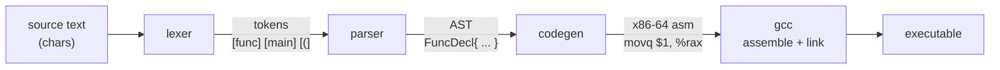
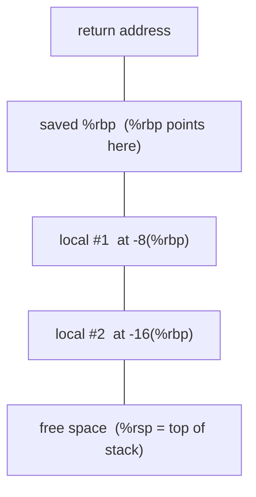
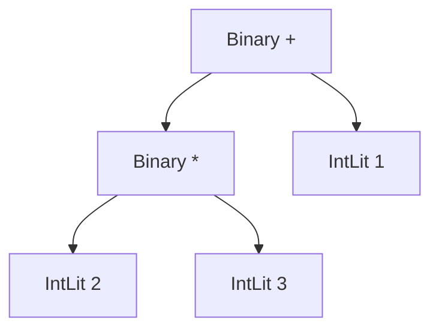
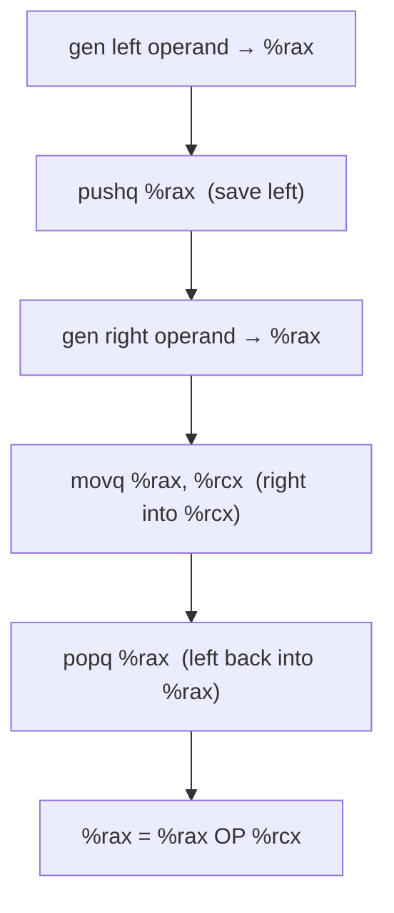

# Writing Your Own Compiler

A build-along guide. You will write a compiler, in Go, for a tiny language
called **Tin**. It reads Tin source and emits real x86-64 assembly, which
`gcc` turns into a native Linux executable.

By the end you will have a compiler you wrote yourself, that compiles a program
with functions, recursion, loops, and arithmetic down to registers and a stack
frame — and you will understand every instruction it emits.

This guide assumes you can program (Go specifically, but any language reader
will follow) and are comfortable on a Linux command line. It does **not**
assume you know assembly. Chapter 1 is a primer that teaches just enough to
read what we generate.

Scope is deliberately small. Every "we are not doing X" is a choice, not an
oversight, and each one points at [`advanced.md`](advanced.md), a roadmap of
where to go next.

---

## Table of contents

0. [What a compiler is](#0-what-a-compiler-is)
1. [Assembly primer](#1-assembly-primer)
2. [The Tin language](#2-the-tin-language)
3. [The lexer](#3-the-lexer)
4. [The AST](#4-the-ast)
5. [The parser](#5-the-parser)
6. [Code generation](#6-code-generation)
7. [Assembling and running](#7-assembling-and-running)
8. [Where to go next](#8-where-to-go-next)

---

## 0. What a compiler is

A compiler is a pipeline. Text goes in one end, machine code comes out the
other. Ours has four stages:



- **Lexer** (or *scanner*): turns a flat string into a list of **tokens** —
  the words of the language. `x = 1 + 2` becomes `IDENT(x) = INT(1) + INT(2)`.
- **Parser**: turns the token list into an **abstract syntax tree** (AST),
  which captures structure. `1 + 2 * 3` becomes a tree where the `*` binds
  tighter than the `+`.
- **Code generator**: walks the AST and emits assembly instructions.
- **Assembler + linker** (`gcc`, which we don't write): turns assembly text
  into a runnable binary.

Real compilers add stages between parsing and codegen — type checking,
optimization, intermediate representations. We skip all of them. A working
four-stage compiler teaches the shape of the whole thing; the extra stages are
depth you add later.

---

## 1. Assembly primer

You only need to read the assembly we emit, not write it fluently. Here is the
minimum.

### The machine model

A CPU has a handful of **registers** — 64-bit slots it computes in — and a
**stack**, a region of memory it pushes and pops values on. We use these
registers:

| Register | Role in our compiler |
|----------|----------------------|
| `%rax`   | the "accumulator" — every expression leaves its result here |
| `%rcx`   | scratch — the right-hand side of a binary operation |
| `%rbp`   | frame pointer — points at the current function's stack frame |
| `%rsp`   | stack pointer — points at the top of the stack |
| `%rdi`, `%rsi`, `%rdx`, `%rcx`, `%r8`, `%r9` | the first six function arguments |

That last row is the **System V AMD64 calling convention** — the Linux
standard for how functions pass arguments. Argument 1 goes in `%rdi`,
argument 2 in `%rsi`, and so on. Return values come back in `%rax`. We follow
this convention so our functions can call each other, and so we can call libc's
`printf`.

### AT&T syntax

We emit **AT&T syntax**, which is what `gcc`'s assembler (`as`) speaks with no
extra flags. Two things to burn in:

1. **Order is `source, destination`.** `movq %rcx, %rax` means "copy rcx
   *into* rax". This is the opposite of Intel syntax, which you'll see in most
   online references and in `objdump`'s default output. If you read Intel
   examples, mentally flip the operands.
2. **Sigils:** registers get a `%`, immediate (literal) values get a `$`. So
   `movq $5, %rax` puts the literal 5 into rax. The `q` suffix means "quad" —
   64-bit.

### The instructions we use

```
movq $5, %rax        # rax = 5
movq %rcx, %rax      # rax = rcx
movq -8(%rbp), %rax  # rax = memory at (rbp - 8)   ← load a local variable
movq %rax, -8(%rbp)  # memory at (rbp - 8) = rax   ← store a local variable
pushq %rax           # push rax onto the stack (rsp -= 8, then store)
popq %rax            # pop the stack into rax (load, then rsp += 8)
addq %rcx, %rax      # rax = rax + rcx
subq %rcx, %rax      # rax = rax - rcx
imulq %rcx, %rax     # rax = rax * rcx
cqto                 # sign-extend rax into rdx:rax (division needs this)
idivq %rcx           # rax = (rdx:rax) / rcx    (signed)
cmpq %rcx, %rax      # compare rax to rcx, set flags (computes rax - rcx)
setl %al             # al = 1 if the last cmp was "less than", else 0
movzbq %al, %rax     # zero-extend the byte al into the full rax
negq %rax            # rax = -rax
jmp .Llabel          # unconditional jump
je .Llabel           # jump if the last cmp was equal (zero)
call name            # push return address, jump to `name`
leave                # tear down the frame: movq %rbp,%rsp ; popq %rbp
ret                  # pop the return address and jump back to the caller
```

`%al` is the low 8 bits of `%rax`. The `set*` instructions only write a byte,
so we always follow them with `movzbq` to get a clean 0 or 1 in the full
register.

### A stack frame

When a function runs, it carves out a **frame** on the stack for its local
variables. The standard prologue and epilogue:

```
myfunc:
    pushq %rbp          # save the caller's frame pointer
    movq %rsp, %rbp     # this function's frame pointer = current stack top
    subq $16, %rsp      # reserve 16 bytes for locals
    ...                 # body: locals live at -8(%rbp), -16(%rbp), ...
    leave               # restore rsp and rbp
    ret                 # return to caller
```

After `pushq %rbp`, the frame pointer `%rbp` is a fixed anchor for the whole
function. Local variable #1 lives at `-8(%rbp)`, #2 at `-16(%rbp)`, and so on.
Because `%rbp` doesn't move, these offsets are constant — that's the whole
point of having a frame pointer.



(Higher addresses at the top. The stack grows downward, so `%rsp` sits at the
bottom and each local is a fixed negative offset from the anchor `%rbp`.)

That is enough assembly. Everything the compiler emits is built from the list
above.

---

## 2. The Tin language

Tin is small on purpose. Here is a complete program — recursive Fibonacci:

```tin
func fib(n) {
    if n < 2 {
        return n;
    }
    return fib(n - 1) + fib(n - 2);
}

func main() {
    print fib(10);
}
```

Running it prints `55`.

### The rules

- **One type: 64-bit signed integer.** No strings, no floats, no booleans.
  Comparisons produce `1` or `0`.
- **Programs are a list of functions.** Execution starts at `main`.
- **`func name(params) { ... }`** declares a function. Up to six parameters
  (we pass them in registers; six is the calling convention's register budget).
- **`let x = expr;`** declares a local variable. **`x = expr;`** reassigns one.
- **`if cond { ... } else { ... }`** — the `else` is optional. Any nonzero
  value is "true".
- **`while cond { ... }`** loops.
- **`return expr;`** returns a value.
- **`print expr;`** prints an integer followed by a newline (this is our one
  built-in; it calls libc's `printf`).
- **Operators:** `+ - * /`, comparisons `< > <= >= == !=`, unary minus,
  parentheses. Standard precedence.

### The grammar

Written as EBNF (`{ }` means "zero or more", `[ ]` means "optional"):

```ebnf
program    = { funcDecl } ;
funcDecl   = "func" IDENT "(" [ IDENT { "," IDENT } ] ")" block ;
block      = "{" { statement } "}" ;
statement  = "let" IDENT "=" expr ";"
           | IDENT "=" expr ";"
           | "if" expr block [ "else" block ]
           | "while" expr block
           | "return" expr ";"
           | "print" expr ";"
           | expr ";" ;
expr       = equality ;
equality   = comparison { ( "==" | "!=" ) comparison } ;
comparison = term       { ( "<" | ">" | "<=" | ">=" ) term } ;
term       = factor     { ( "+" | "-" ) factor } ;
factor     = unary      { ( "*" | "/" ) unary } ;
unary      = "-" unary | primary ;
primary    = INT
           | IDENT
           | IDENT "(" [ expr { "," expr } ] ")"
           | "(" expr ")" ;
```

That layering — `equality` contains `comparison` contains `term` contains
`factor` — is how the grammar encodes **precedence**. Operators lower in the
chain (like `*`) bind tighter because they're matched deeper in the tree.
We'll see exactly how in the parser.

### Errors

Tin's compiler stops at the first error and reports a line number. That's it.
Real compilers recover from an error and keep going so they can report several
at once, with a caret pointing at the exact column — but error recovery is a
substantial topic that would swamp the parser chapter. We take the honest
shortcut and note it. See [`advanced.md`](advanced.md).

### Sharp edges

Three deliberate simplifications, worth knowing before they surprise you:

- **Variables are function-scoped, not block-scoped.** A `let` inside an `if`
  or `while` reuses an outer variable of the same name rather than shadowing
  it. So this prints `2` then `2`, not `2` then `1`:

  ```tin
  let x = 1;
  if 1 { let x = 2; print x; }
  print x;
  ```

  We'll see why in [chapter 6](#variables-and-frames): every variable gets one
  frame slot, keyed by name.

- **A `main` function is required.** The compiler reports
  `no 'main' function to run` up front, rather than letting the failure surface
  later as a cryptic `undefined reference to 'main'` from the linker.

- **Division by zero is not checked.** `1 / 0` compiles and then crashes at
  runtime with `SIGFPE`, straight from the CPU's `idivq`. Guarding it would
  mean generating a runtime check around every division — a fine exercise, left
  out here.

---

## 3. The lexer

The lexer's job: turn source text into a stream of tokens. It reads left to
right, skips whitespace and comments, and emits one token per meaningful chunk.

### Token types

Every token has a **kind** and, for some kinds, a **value**:

```go
type TokenKind int

const (
    TEOF TokenKind = iota
    TInt      // 42
    TIdent    // foo, main
    // keywords
    TFunc; TLet; TIf; TElse; TWhile; TReturn; TPrint
    // punctuation and operators
    TLParen; TRParen; TLBrace; TRBrace; TComma; TSemicolon
    TAssign   // =
    TPlus; TMinus; TStar; TSlash
    TEq; TNe; TLt; TGt; TLe; TGe   // == != < > <= >=
)

type Token struct {
    Kind TokenKind
    Text string // the raw text, e.g. "42" or "main"
    Line int     // for error messages
}
```

### The scanning loop

The lexer holds the source and a cursor. Each call to `next()` skips
whitespace, looks at the current character, and decides what token starts here:

- A digit → read the whole run of digits, emit `TInt`.
- A letter → read the whole identifier; if it's a keyword, emit that keyword's
  kind, otherwise `TIdent`.
- `=` → peek ahead: `==` is `TEq`, a lone `=` is `TAssign`. Same trick for
  `!=`, `<=`, `>=`.
- Single-character punctuation → the matching token.
- `#` to end of line → a comment, skip it.

The two-character operators are why we **peek**: we can't decide what `=`
means until we've looked at the character after it.

We'll write the whole lexer in Go in the reference implementation. The shape to
remember: a loop that consumes characters and appends `Token`s until it hits
end of input. Keeping a `Line` counter — bumped every time we consume a `\n` —
is what lets the parser and codegen produce "error on line 7" messages.

> **Design note.** Some compilers make the lexer *lazy* — the parser pulls one
> token at a time. We build the entire token slice up front instead. It uses a
> little more memory and is far easier to reason about and debug: you can print
> the whole token stream and see exactly what the lexer thought your program
> was.

---

## 4. The AST

The **abstract syntax tree** is the parser's output: a tree of Go structs that
captures the program's structure with all the punctuation thrown away.

We split nodes into **expressions** (things that produce a value) and
**statements** (things that do something).

```go
// ----- expressions -----
type Expr interface{ isExpr() }

type IntLit struct{ Value int64 }              // 42
type Var    struct{ Name string }              // x
type Unary  struct{ Op string; X Expr }        // -x
type Binary struct{ Op string; L, R Expr }     // a + b
type Call   struct{ Name string; Args []Expr } // f(a, b)

// ----- statements -----
type Stmt interface{ isStmt() }

type LetStmt    struct{ Name string; Value Expr }
type AssignStmt struct{ Name string; Value Expr }
type IfStmt     struct{ Cond Expr; Then, Else []Stmt } // Else may be nil
type WhileStmt  struct{ Cond Expr; Body []Stmt }
type ReturnStmt struct{ Value Expr }
type PrintStmt  struct{ Value Expr }
type ExprStmt   struct{ X Expr }

// ----- top level -----
type FuncDecl struct {
    Name   string
    Params []string
    Body   []Stmt
}

type Program struct{ Funcs []FuncDecl }
```

(The `isExpr()`/`isStmt()` marker methods are a Go idiom for a sum type — they
let us say "any expression" or "any statement" in a type-safe way.)

Notice what the AST throws away: parentheses, semicolons, whitespace, the word
`func`. Those existed only to tell the parser how to build the tree. Once the
tree exists, structure is encoded in its *shape*. `1 + 2 * 3` becomes:



The `*` is a child of the `+`, so it will be evaluated first. Precedence is now
a property of the tree, not of any punctuation.

---

## 5. The parser

The parser turns the token slice into that tree. We use **recursive descent**:
one function per grammar rule, each calling the functions for the rules it
contains. It is the most direct possible translation of the grammar into code —
the function structure mirrors the EBNF line for line.

### Machinery

The parser holds the tokens and a cursor, with a few helpers:

- `peek()` — the current token without consuming it.
- `advance()` — return the current token and step forward.
- `expect(kind)` — consume a token of the given kind or die with an error
  ("line 7: expected `)`"). This is where syntax errors surface.
- `match(kind)` — if the current token is `kind`, consume it and return true;
  otherwise leave it and return false. This drives the `{ ... }` loops in the
  grammar.

### Parsing expressions: precedence climbing

Each precedence level is one function that calls the level below it in a loop.
Here is the `term` level (`+` and `-`):

```go
func (p *parser) term() Expr {
    left := p.factor()                  // parse a higher-precedence operand
    for p.peek().Kind == TPlus || p.peek().Kind == TMinus {
        op := p.advance().Text          // consume + or -
        right := p.factor()             // parse the next operand
        left = &Binary{Op: op, L: left, R: right}
    }
    return left
}
```

Read what this does with `1 + 2 + 3`: it parses `1`, sees `+`, parses `2`,
builds `Binary(1 + 2)`, loops, sees `+`, parses `3`, builds
`Binary((1 + 2) + 3)`. Left-associative, exactly as arithmetic should be.

`comparison` and `equality` are the same function with different operators,
each calling the level below. `factor` (`*`, `/`) calls `unary`, which handles
a leading `-` and otherwise calls `primary`:

```go
func (p *parser) primary() Expr {
    tok := p.peek()
    switch tok.Kind {
    case TInt:
        p.advance()
        return &IntLit{Value: parseInt(tok.Text)}
    case TIdent:
        p.advance()
        if p.match(TLParen) {           // it's a call: name(...)
            args := p.argList()
            p.expect(TRParen)
            return &Call{Name: tok.Text, Args: args}
        }
        return &Var{Name: tok.Text}     // otherwise a plain variable
    case TLParen:
        p.advance()
        e := p.expr()
        p.expect(TRParen)
        return e
    }
    p.fail("expected an expression")
    return nil
}
```

This is the whole trick of recursive descent: the call stack *is* the grammar.
When `primary` hits `(`, it calls all the way back up to `expr` to parse the
inner expression, then expects the closing `)`. The nesting of parentheses in
the source becomes the nesting of recursive calls.

### Parsing statements

`statement()` looks at the first token and dispatches:

```go
func (p *parser) statement() Stmt {
    switch p.peek().Kind {
    case TLet:    return p.letStmt()
    case TIf:     return p.ifStmt()
    case TWhile:  return p.whileStmt()
    case TReturn: return p.returnStmt()
    case TPrint:  return p.printStmt()
    default:
        // either `name = expr;` (assignment) or a bare `expr;`
        ...
    }
}
```

Each of those parses its keyword, then the pieces the grammar says follow it.
`ifStmt`, for example: consume `if`, parse the condition expression, parse a
`block` (a `{`, statements until `}`), and if the next token is `else`, parse
another block.

At the top, `parse()` loops calling `funcDecl()` until it hits `TEOF`, and
returns a `Program`. The reference implementation has all of this in full.

---

## 6. Code generation

Now we walk the AST and emit assembly. This is where the ideas become
instructions.

### The core idea: a stack machine

Our codegen strategy is the simplest one that works: treat the hardware stack
as a **value stack**.

**Every expression, when generated, leaves its result in `%rax`.** That's the
one invariant. Given that, a binary operation writes itself:

1. Generate the left operand → its result is in `%rax`.
2. `pushq %rax` — save it on the stack.
3. Generate the right operand → its result is now in `%rax`.
4. `movq %rax, %rcx` — move the right operand into `%rcx`.
5. `popq %rax` — restore the left operand into `%rax`.
6. Now `%rax` = left, `%rcx` = right. Emit the operator.



In Go:

```go
func (g *gen) expr(e Expr) {
    switch e := e.(type) {
    case *IntLit:
        g.emit("movq $%d, %%rax", e.Value)
    case *Var:
        g.emit("movq %d(%%rbp), %%rax", g.offset(e.Name))
    case *Unary: // only "-"
        g.expr(e.X)
        g.emit("negq %%rax")
    case *Binary:
        g.expr(e.L)              // left → rax
        g.push()                 // save it
        g.expr(e.R)              // right → rax
        g.emit("movq %%rax, %%rcx")
        g.pop("%rax")            // left back into rax
        g.binop(e.Op)            // rax = rax OP rcx
    case *Call:
        g.call(e)
    }
}
```

`binop` maps each operator to its instruction:

```go
func (g *gen) binop(op string) {
    switch op {
    case "+": g.emit("addq %%rcx, %%rax")
    case "-": g.emit("subq %%rcx, %%rax")
    case "*": g.emit("imulq %%rcx, %%rax")
    case "/": g.emit("cqto"); g.emit("idivq %%rcx")
    case "==", "!=", "<", ">", "<=", ">=":
        g.emit("cmpq %%rcx, %%rax")
        g.emit("%s %%al", setInstr[op]) // sete, setne, setl, ...
        g.emit("movzbq %%al, %%rax")
    }
}
```

Walk `1 + 2 * 3` through this and you get exactly the seven-instruction
sequence that computes 7, with the `*` happening before the `+` because the AST
put it deeper. The stack machine handles arbitrary nesting for free: each
subexpression saves its result before the next one clobbers `%rax`.

It is not *fast* code — everything bounces through the stack — but it is
obviously correct, and correctness first is the right call for a first
compiler. Making it fast is register allocation, which is in
[`advanced.md`](advanced.md).

### Variables and frames

Before generating a function body, we walk it once to assign every parameter
and `let` a stack slot: the first gets offset `-8`, the next `-16`, and so on.
`g.offset(name)` looks up that number. Loading a variable is
`movq -8(%rbp), %rax`; storing is `movq %rax, -8(%rbp)`.

The function prologue reserves space for all the slots (rounded up to a
multiple of 16 — the calling convention requires the stack stay 16-byte
aligned), then copies incoming parameters from their argument registers into
their slots:

```
myfunc:
    pushq %rbp
    movq %rsp, %rbp
    subq $16, %rsp          # room for the locals
    movq %rdi, -8(%rbp)     # param 1 → slot 1
    movq %rsi, -16(%rbp)    # param 2 → slot 2
    ...body...
    leave
    ret
```

### Control flow

`if` and `while` compile to compares and jumps. Each needs unique labels, so
codegen keeps a counter and mints `.L0`, `.L1`, ... as it goes.

`if cond { then } else { els }`:

```
    <generate cond → rax>
    cmpq $0, %rax
    je .Lelse            # condition was false (zero)
    <generate then>
    jmp .Lend
.Lelse:
    <generate els>
.Lend:
```

`while cond { body }`:

```
.Lstart:
    <generate cond → rax>
    cmpq $0, %rax
    je .Lend             # condition false → exit loop
    <generate body>
    jmp .Lstart
.Lend:
```

That's all a loop is at the machine level: a label, a conditional jump out, and
an unconditional jump back.

### Function calls, and the one real subtlety

To call `f(a, b)`:

1. Generate each argument and push it (left to right).
2. Pop them into the argument registers `%rdi`, `%rsi`, ... (in reverse, so
   they land in the right registers).
3. `call f`.
4. The result is in `%rax` — which is exactly our invariant, so nothing more
   to do.

We evaluate all arguments onto the stack *before* moving any into registers.
That's what makes nested calls like `f(a, g(b))` work: `g`'s call would
otherwise clobber the argument registers we'd already set up for `f`.

Here is the subtlety, and it's a real one. The System V convention requires
`%rsp` to be 16-byte aligned **at the moment of a `call`**. Our value-stack
pushes move `%rsp` by 8 at a time, so in the middle of an expression like
`1 + f(2)`, the stack can be off by 8 when we reach the `call`. If it is,
`printf` (which uses 16-byte-aligned SSE instructions) crashes.

The fix: the codegen tracks how many values are currently pushed (`g.depth`).
That count tells us at *compile time* whether `%rsp` is misaligned. If it is,
we bump it before the call and restore it after:

```go
func (g *gen) call(c *Call) {
    for _, a := range c.Args { g.expr(a); g.push() }
    for i := len(c.Args) - 1; i >= 0; i-- { g.pop(argRegs[i]) }

    pad := g.depth%2 == 1        // odd depth ⇒ rsp is 8 off
    if pad { g.emit("subq $8, %%rsp") }
    g.emit("call %s", c.Name)
    if pad { g.emit("addq $8, %%rsp") }
}
```

This is the kind of detail a naive strategy forces into the open, and it's
worth meeting head-on rather than having it crash mysteriously. Every serious
compiler solves the same problem; ours just solves it in four lines.

### `print` and the program skeleton

`print e` generates `e` into `%rax`, moves it to `%rsi` (printf's second
argument), points `%rdi` at a format string, zeroes `%rax` (the varargs
convention: "no SSE registers used"), and calls `printf`:

```
    <generate e → rax>
    movq %rax, %rsi
    leaq .LC0(%rip), %rdi
    movq $0, %rax
    call printf@PLT
```

(`@PLT` and the `%rip`-relative address are what make this work on modern Linux,
where binaries are position-independent by default.)

The whole emitted file is wrapped in a skeleton:

```
    .section .rodata
.LC0:
    .string "%ld\n"        # printf format for a 64-bit int + newline
    .text
    .globl main            # the linker needs main to be visible
<...all the functions...>
```

Because our `main` becomes the assembly symbol `main`, libc's startup code
calls it like any C `main`, and whatever `main` leaves in `%rax` becomes the
process exit code.

---

## 7. Assembling and running

The compiler prints assembly to stdout. `gcc` does the rest:

```sh
go build -o tinc ./reference        # build the compiler
./tinc program.tin > program.s      # compile Tin → assembly
gcc program.s -o program            # assemble + link with libc
./program                           # run it
```

`gcc` here is doing two jobs: the **assembler** (`as`) turns `program.s` into
an object file, and the **linker** (`ld`) joins it with the C library so
`printf` resolves. We lean on gcc for both because writing an assembler and
linker is a whole separate project — and an excellent one, but not this one.

The reference implementation ships example programs and a `test.sh` that
compiles, links, runs, and checks each one's output. Run it to confirm your
build works end to end.

---

## 8. Where to go next

You now have a real compiler. Everything it doesn't do is a direction to grow,
and each is written up as a starting point in [`advanced.md`](advanced.md):

- **Better errors** — line *and* column, a caret under the offending token, and
  recovery so one run reports many errors.
- **A type checker** — introduce a `bool` type, catch `1 + (2 < 3)` before it
  runs, and lay the groundwork for more types.
- **Arrays and strings** — the first types that don't fit in a register, which
  forces real memory layout and pointers.
- **Register allocation** — stop bouncing every value through the stack; this
  is the single biggest quality jump in the emitted code.
- **An optimizer** — constant folding, dead-code elimination, and the
  intermediate representation that makes them tractable.

Build the core until it's second nature, then pick one and go deep. Each is its
own guide's worth of material — which is exactly why they're a roadmap here and
not crammed into this one.
